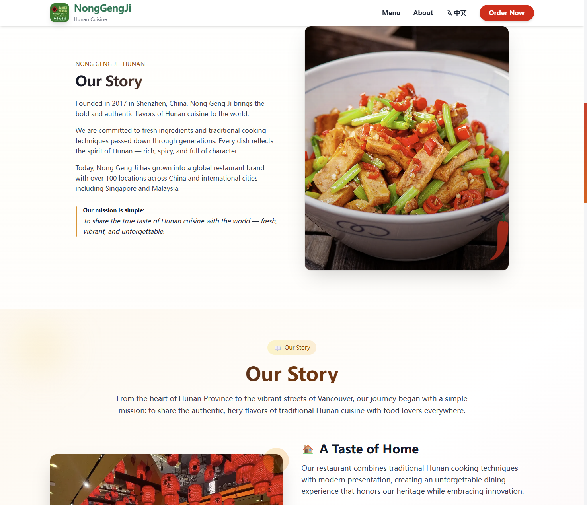
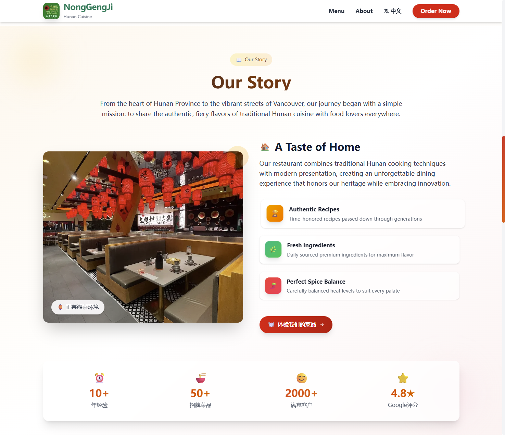
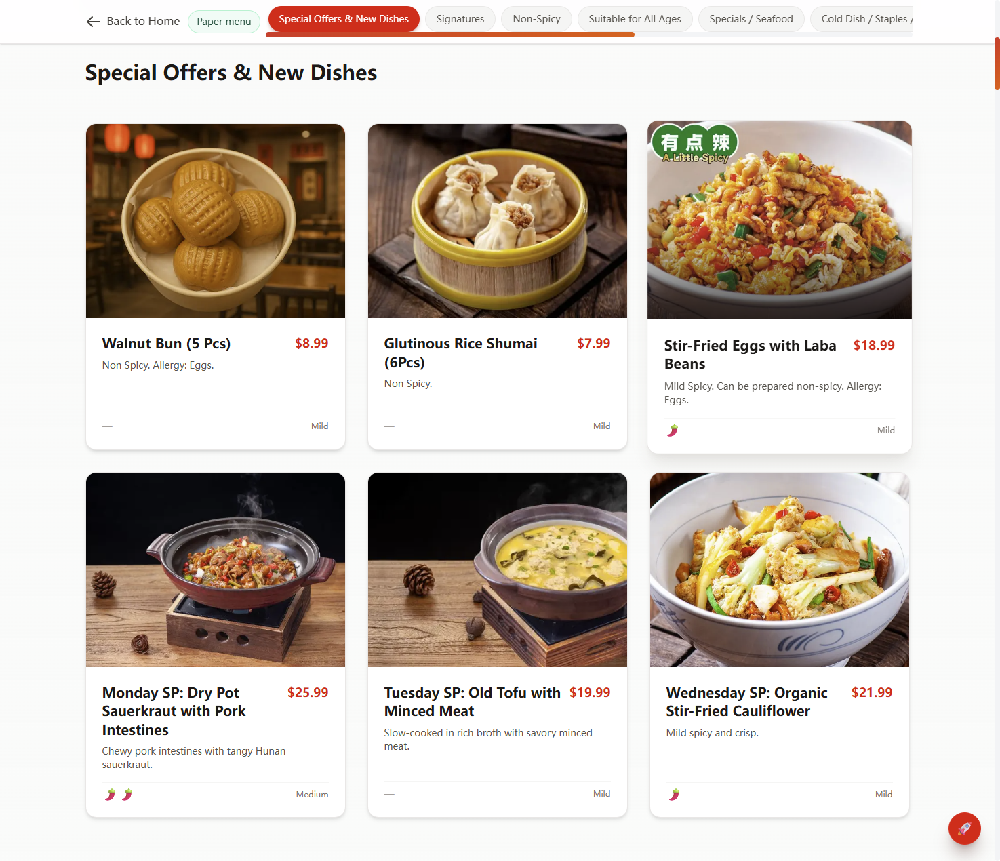
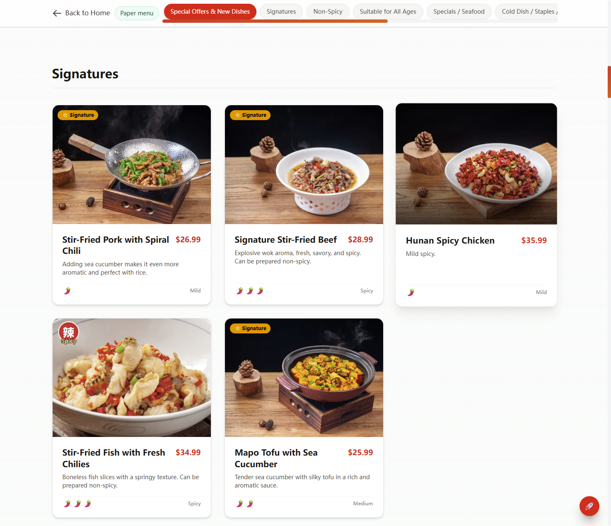

# Farmer’s Journal — Nong Geng Ji (农耕记)

English-first marketing site for **Nong Geng Ji**, a Hunan (湘菜) restaurant in Richmond, BC. Built as a portfolio piece: bilingual UI, full menu with imagery, Google reviews integration, and a polished responsive layout.

**Live site:** [https://nonggengji-english.vercel.app/](https://nonggengji-english.vercel.app/)

---

## Highlights

- **Next.js App Router** — static pages, fast first paint, SEO-friendly metadata  
- **Bilingual** — English / 中文 via a lightweight translation map (`src/data/translations.ts`) and `LanguageContext`  
- **Menu experience** — categories, dish cards, detail modal, **paper menu** scans with lightbox zoom, back-to-top navigation  
- **Content** — menu driven by `data/menu.json` + `src/data/menu-db.ts`; customer-facing copy centralized in translations  
- **Motion & UI** — Framer Motion for sections and interactions; Tailwind CSS 4  

---

## Tech stack

| Area        | Choice                                      |
| ----------- | ------------------------------------------- |
| Framework   | [Next.js](https://nextjs.org/) 15.x (App Router) |
| UI          | React 19, Tailwind CSS 4                    |
| Animation   | Framer Motion                               |
| Language    | TypeScript                                  |
| Deploy      | [Vercel](https://vercel.com/)               |

---

## Screenshots

<p align="center">
  
  
</p>
<p align="center">
  
  
</p>
<p align="center">
  
  
</p>
<p align="center">
  
  
</p>

---

## Getting started

```bash
npm install
npm run dev
```

Open [http://localhost:3000](http://localhost:3000).

### Useful scripts

| Script            | Purpose |
| ----------------- | ------- |
| `npm run dev`     | Development server (webpack) |
| `npm run dev:safe`| Clear `.next` then `next dev` if the dev cache misbehaves |
| `npm run clean`   | Remove `.next` and `node_modules/.cache` |
| `npm run build`   | Production build |
| `npm run build:clean` | `clean` + `build` |
| `npm run lint`    | ESLint |

---

## Project structure (abbreviated)

```
src/
  app/
    layout.tsx          # Root layout, fonts, LanguageProvider
    page.tsx            # Home
    menu/page.tsx       # Full menu + paper menu lightbox
    components/         # Hero, About, Navbar, Menu highlights, etc.
  contexts/
    LanguageContext.tsx
  data/
    translations.ts     # EN/ZH strings
    menu-db.ts          # Menu loader & helpers
    menu.json / …       # Structured content (see repo)
data/
  menu.json             # Menu source data (categories/items)
public/
  images/               # Marketing & hero assets
  menu/                 # Dish photos by category
  show_case/            # README screenshots
```

---

## Environment

The public marketing build does not require a database. Optional tooling under `scripts/` (e.g. Supabase helpers) expects **environment variables only** — do not commit API keys or service role secrets.

---

## License & credits

Restaurant branding and content belong to **Nong Geng Ji**. This repository is maintained for portfolio and deployment demonstration.

---

<p align="center">
  <a href="https://nonggengji-english.vercel.app/">View live demo →</a>
</p>
