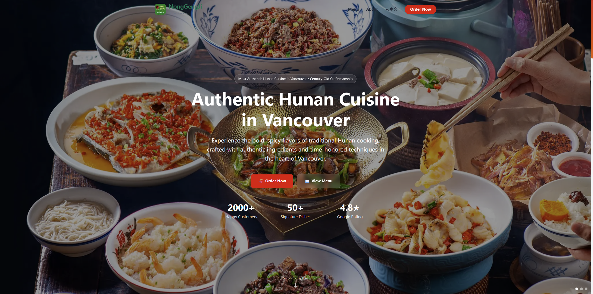
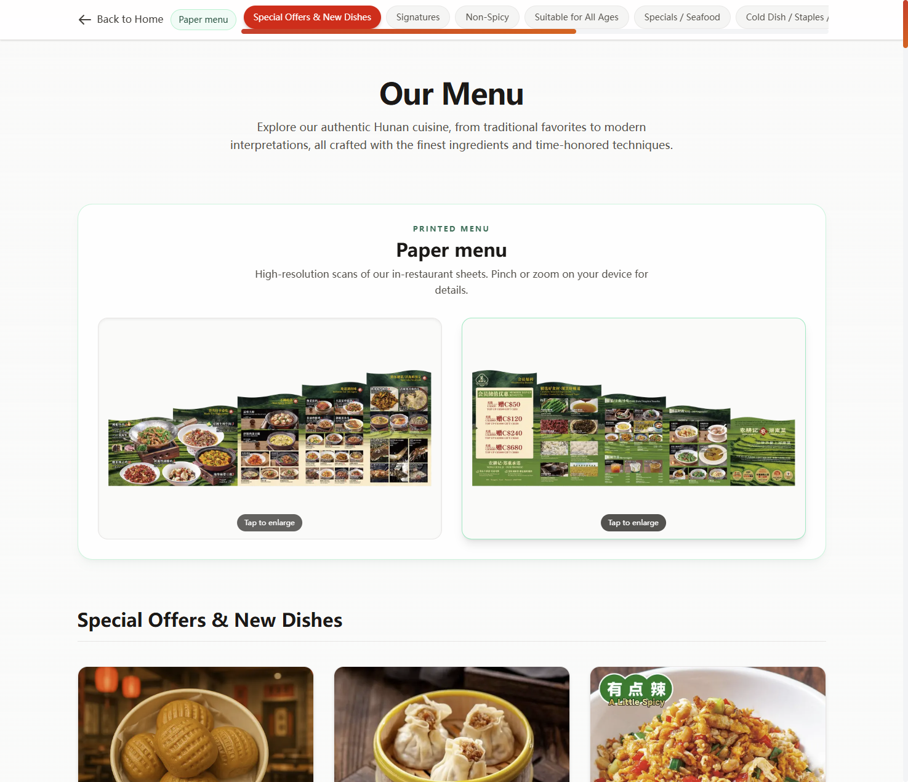
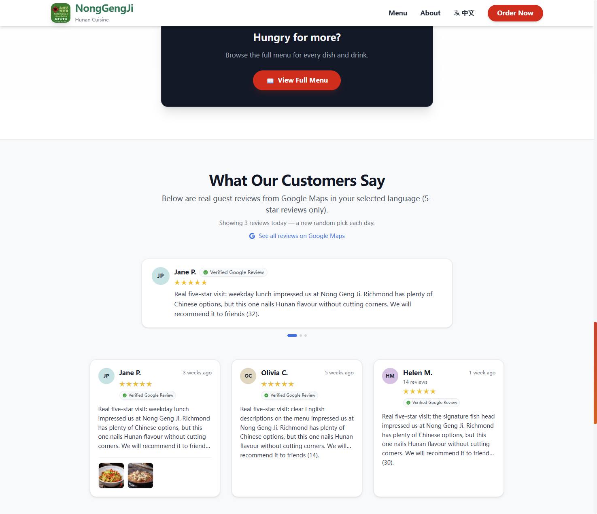
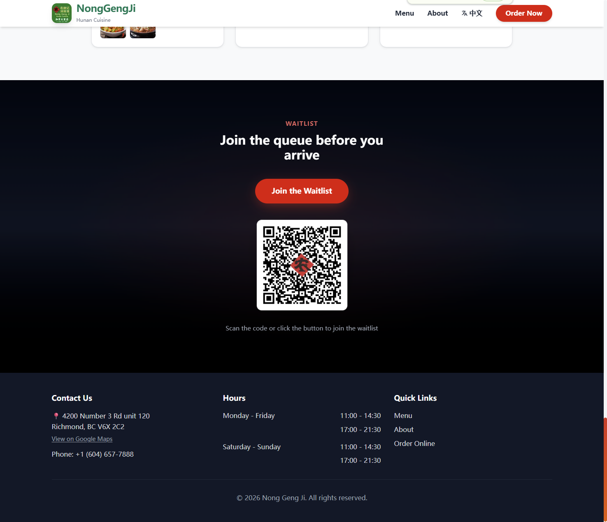

# NongGengJi Restaurant Website
### *(Farmer’s Journal)*

**An English-first marketing experience for authentic Hunan cuisine in Vancouver**

---

## Live Demo 🌐

**Production:** [nonggengji-english.vercel.app](https://nonggengji-english.vercel.app/)

Open it on desktop or mobile — the layout is tuned for both.

---

## Project Overview

This is a **real restaurant marketing site** built for **Nong Geng Ji (农耕记)**, a Hunan (湘菜) restaurant. The focus is not a generic landing page: it is an **English-first** experience aimed at **Western guests** who may be discovering Hunan food for the first time — clear copy, appetizing visuals, and a calm, trustworthy layout.

What we optimized for:

- **UI & UX** — Readable hierarchy, warm palette, motion that supports the story (not distraction).
- **Food presentation** — Full **menu browsing** with photos, categories, and detail views so dishes feel tangible before guests walk in.
- **Trust** — Story-driven “About” sections, stats, and **curated guest sentiment** so first-time visitors feel confident choosing the restaurant.

---

## Key Features ✨

| | |
| :--- | :--- |
| **Bilingual experience** | English and Chinese — one toggle, consistent tone across navigation, hero, menu, and footer. |
| **Menu system (JSON-driven)** | Structured data powers categories, pricing, tags (e.g. signature / spice level), and scalable updates without touching layout code. |
| **Customer reviews** | Real Google Maps–style social proof, surfaced in the guest’s selected language where possible. |
| **Responsive design** | From large hero imagery to dense menu grids — tuned for phones (where most diners discover restaurants). |
| **SEO-minded** | Semantic structure, metadata, and static-friendly Next.js routes so the site is easy to index and share. |

---

## Screenshots 📸

  <strong>Hero & first impression</strong> 
  

  <strong>Menu & dishes</strong> 
  

  <strong>Reviews & trust</strong> 
  

  <strong>Waitlist</strong> 
  

---

## Tech Stack

Built with tools that match a **fast, maintainable** product surface:

| Layer | Technology |
| :--- | :--- |
| Framework | **Next.js** (App Router) |
| Styling | **Tailwind CSS** |
| Language | **TypeScript** |
| Data & backends | **Supabase**-ready workflows (e.g. storage / admin scripts); public site uses static JSON where appropriate |
| Deploy | **Vercel** |

---

## Design Thinking 💭

**Why English-first?**  
Hunan cuisine is bold and nuanced — but many Western diners start from zero vocabulary. An English-led site lowers friction: clear dish names, short descriptions, and a tone that feels **inviting**, not intimidating. Chinese remains available for bilingual guests and community sharing.

**Why this UI direction?**  
Warm neutrals, strong photography, and restrained motion mirror a **real dining room**: welcoming, not flashy. Cards and spacing prioritize **scannability** — people compare prices and spice levels quickly on their phones.

**How we appeal to international guests?**  
- Lead with **familiar hooks** (location, hours, ordering) and **discovery** (signature dishes, story).  
- Use **consistent visual language** so the brand feels established.  
- Let **food imagery** do the heavy lifting — text supports, never overloads.

---

## What I Learned 📚

- **Product & UI** — Balancing restaurant branding with clarity; every section competes for attention, so hierarchy matters more than “more content.”
- **UX** — Menu-heavy flows need predictable navigation (categories, scroll position, modal details) so users never feel lost.
- **Internationalization** — Bilingual isn’t two copies of the same page — it’s shared structure, copy length differences, and one mental model for switching language.
- **Shipping** — Connecting design choices to deployable, performant pages (static generation, image handling, real devices).

---

## Future Improvements 🔮

Ideas on the roadmap:

- **Smarter discovery** — Dish recommendations based on spice tolerance or dietary notes (rules-based first, **AI-assisted** copy or pairing suggestions later).
- **Richer reservations / waitlist** — Deeper integration with queueing or booking flows.
- **Performance & media** — Further image optimization and optional CDN for global latency.
- **Content CMS** — Optional headless CMS or Supabase-backed editing for non-developer updates.

---

## Repository

**Portfolio / showcase (this listing):**  
[github.com/9OwO6/nonggengji-restaurant-website](https://github.com/9OwO6/nonggengji-restaurant-website)

Development history may also live alongside related work under the same organization — the live demo above always reflects the latest public deployment.

---

**Built as a real client–style restaurant project — design, content, and UX treated as one product.**

[Open live site](https://nonggengji-english.vercel.app/)

